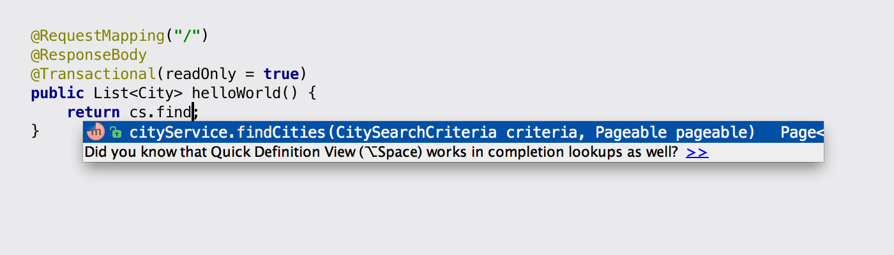
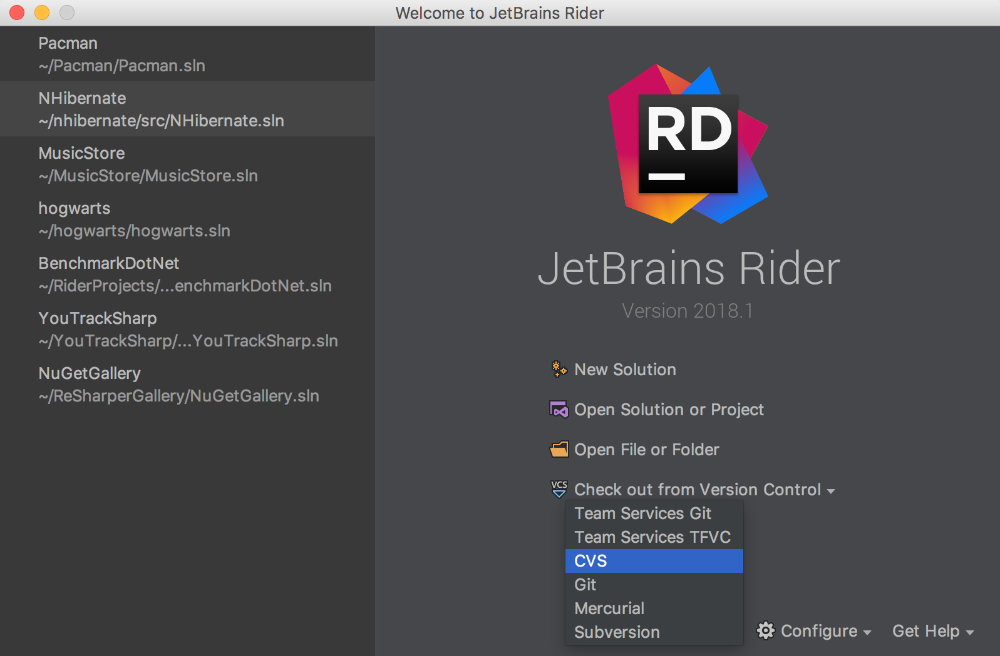

# What this repository is for
[](https://confluence.jetbrains.com/display/ALL/JetBrains+on+GitHub)

This repository contains a collection of HTML-based slides about JetBrains tools that is used to play back at expo booths whenever JetBrains makes a booth appearance at a sponsored conference.

It is based on [reveal.js](https://github.com/hakimel/reveal.js/), a HTML-based presentation framework. For detailed info about reveal.js, see [the framework's own README](https://github.com/hakimel/reveal.js/blob/191dbe68d5aab45bb93e3d839dbc025c3f5b6f3c/README.md).

## How to set up presentation playback at a conference

1. Download and unpack the latest revision from this repository's `master` branch (unless you have agreed to use a different revision) to an Intel NUC device that will be used to display presentations.

2. If necessary, modify the playlist to match a particular conference type. (See *How to select a playlist* below)

3. Double-click `jetbrains-tools.html`. Presentations will be played back in a loop.

You don't need to connect the device to the Internet: the presentations are self-contained and will work offline.

### How to select a playlist
By default, no playlist is defined, which means that all available products will be shown.

If necessary, select a playlist that best matches your conference. There are several predefined playlists for different types of conferences, such as a .NET-focused, C++ focused, or JVM-focused conference.

To select a playlist:

1. Go to `js/playlist.js`

2. Change variable `currentPlaylist` so that one of the playlists defined in the `conferenceType` object is assigned to it. For example, for a .NET-focused conference, make the following assignment: `var currentPlaylist = conferenceType.dotnet;`

3. Save changes to `js/playlist.js`.


## How to add or edit presentation slides

Here's the general procedure for editing slides:

1. Clone this repository: `git clone https://github.com/jetbrains/reveal.js.git`

2. Open the project in WebStorm or another editor.

3. Edit slides contained in `jetbrains-tools.html`. Use `img/screenshots/productname` to store images and videos. (See *How slides are organized* below to get an idea of the types of slides generally used.)

4. Commit and push your changes to the `master` branch (unless agreed otherwise).


### How slides are organized

Slides for all products are stored in a single file, `jetbrains-tools.html`. Here's a simplified structure of the file:

```html
<html>
	<head>
		<link rel="stylesheet" href="css/reveal.css">
		<link rel="stylesheet" href="css/theme/jetbrains.css">
	</head>
	<body>
		<div class="reveal">
			<div class="slides">
			
			<!-- ReSharper slides -->
			
				<section data-product="resharper">
                    <h2>Enjoy continuous code quality analysis</h2>
                    <p></p>
                </section>
                
            <!-- More ReSharper slides -->    
            
            <!-- IntelliJ IDEA slides -->
            
                <section data-product="intellij">
                    <h2>Smart code completion</h2>
            		<p>Smart completion only suggests types that are expected in the current context</p>
            		<p></p>
                </section>
                
            <!-- More IntelliJ IDEA slides -->
            
            <!-- Your product's slides -->
                
			</div>
		</div>
		<script src="js/reveal.js"></script>
		<script>
			Reveal.initialize();
		</script>
	</body>
</html>
```

As seen in this sample, each slide is represented with a `<section>` tag that has a `data-product="yourProductName"` attribute. The attribute is necessary to make sure that a slide contains product-specific logo and beam, and (if a playlist is defined) to select which slides to play back and which to omit.

Typically, you will use the following types of slides:

### Intro slide

This is what you start your product's set of slides with. The slide contains product name, quick description of the product and its logo.

Example:
```
<section data-product="dottrace">
    <h2>dotTrace</h2>
    <p>.NET performance profiler</p>
    <div class="jetbrains-logo _logo-dottrace _size-5"></div>
</section>
```

### Image slide

This is your regular slide illustrated with a static image. The header (`<h2>`) is expected to contain an expressive caption to the image. If you need more space for the caption, avoid long headers: instead, use an additional paragraph (`<p>`) between the header and the image.

Example:
```
<section data-product="rider">
    <h2>Write .NET code on Windows, Mac, Linux</h2>
    <p>in an IDE similar to WebStorm, IntelliJ IDEA, other JetBrains tools</p>
    <p>
        
    </p>
</section>
```

### Video slide

You can insert part-screen videos in your slides instead of static images: use `<video>` tags for this purpose. Make sure to insert the `data-autoplay` attribute to make the video start automatically as soon as its container slide is loaded.

Reveal.js will automatically extend the length of the video slide to accommodate the entire duration of your video.

Example:
```
<section data-product="appcode">
    <h2>Create faster</h2>
    <p>with smarter completion</p>
    <video data-autoplay src="img/screenshots/appcode/completion.mp4"/>
</section>
```

If you want your video to occupy as much screen estate as possible, use `class="stretch"` on the video: the video will be displayed as large as possible while still keeping a product-specific slide header visible. You might want to remove a slide title for even better stretching.

Example:
```
<section data-product="teamcity">
    <video class="stretch" data-autoplay src="img/screenshots/teamcity/video_easy_setup.mp4" />
</section>
```

### GIF slide

GIFs are just another alternative to static images and videos, and you insert GIFs like you would insert a regular static image.

However, note that Reveal.js can't detect the duration of your GIF and alter slide duration accordingly. This means that you need to calculate GIF duration yourself and set the `data-autoslide` attribute of your slide (`<section>`) to match the duration of your GIF in milliseconds.

Example:
```
<section data-product="resharper" data-autoslide="25000">
    <h2>Navigate between structural pieces of code</h2>
    <p>like you're tabbing through a web page in a browser</p>
    <p>
        
    </p>
</section>
```

### Outro slide

This is what concludes the set of slides about any product.

Example:
```
<section data-product="dotcover">
	<h2>Learn more and download a free 30-day trial</h2>
	<p>jetbrains.com/dotcover</p>
	<div class="jetbrains-logo _logo-dotcover _size-5"></div>
</section>
```
